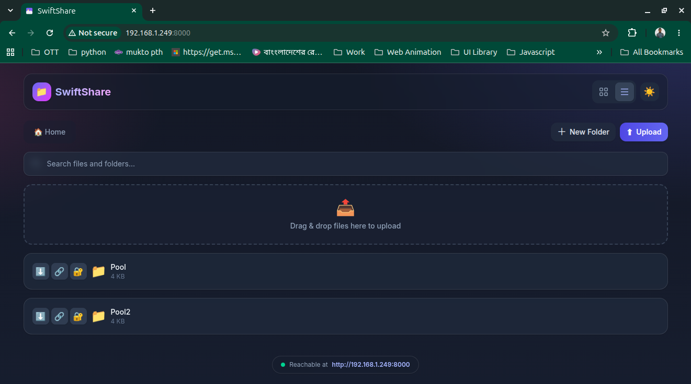
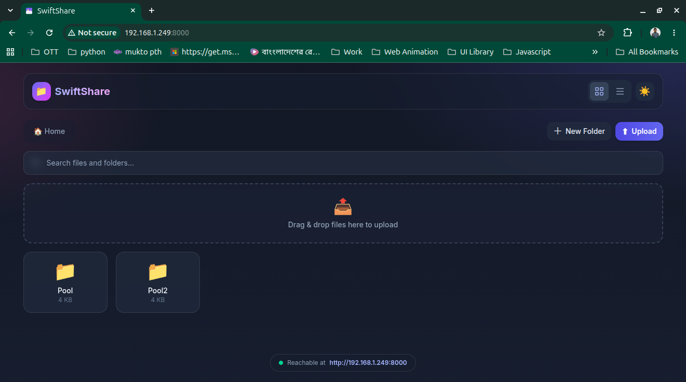
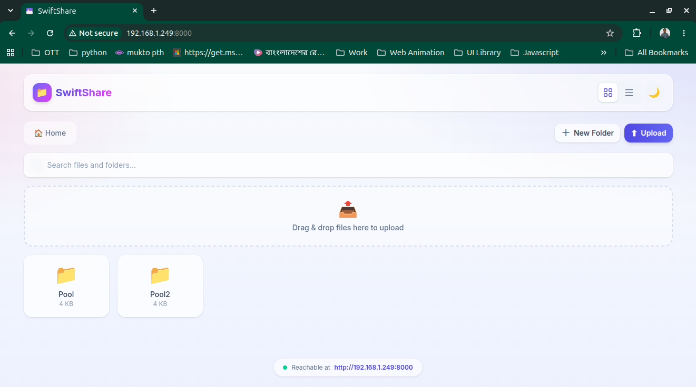

# SwiftShare

A beautiful, easy-to-use local-network file-sharing web app. Run it on any machine
and browse, upload, download, preview, and share files from any device on the same
network — phone, tablet, or laptop.


---

## Features

- **File browser** — browse directories and files with breadcrumb navigation, grid/list views, and file-type icons.
- **Drag & drop upload** — drop files anywhere on the page to upload them to the current folder.
- **Download** — download individual files, or entire folders as a ZIP archive.
- **Create / delete** — make new folders and delete files or folders from the UI.
- **Preview** — inline preview for images, video, audio, and PDFs, plus text-file preview.
- **Sharing** — generate shareable links for any file with optional expiry and password protection, and track download counts.
- **Search** — live filter of the current folder by name.
- **Live transfer progress** — real-time progress bar for both uploads and downloads, showing percentage and transferred size (bytes sent/received).
- **Dark / light theme** — toggle in the header; preference is remembered.
- **Local-network friendly** — auto-detects the machine's LAN IP, shows the connection URL, and serves a QR code for quick mobile pairing (see `/api/ip`).
- **Modern UI** — clean, responsive design with toast notifications, progress feedback, and smooth animations.

## Screenshots

<div align="center">
  
  <p><em>File browser with grid view, breadcrumb navigation, and drag-and-drop upload.</em></p>
  
  <p><em>Dark mode with glassmorphism header and redesigned cards.</em></p>
  
  <p><em>Share dialog with expiry and password protection.</em></p>
</div>

## Usage

- **Browse** — The `shared/` folder is your home directory. Click a folder to open it, or use the breadcrumb (🏠 Home) to jump back. Switch between **grid** and **list** views with the header toggle.
- **Upload** — Click **Upload**, or drag & drop files anywhere onto the drop zone. A floating progress bar appears at the bottom showing the file name, percentage, and bytes transferred.
- **Download** — Click the ⬇️ action on a file (or on a folder to get a ZIP archive). Downloads also show a live progress bar as bytes are received.
- **New folder / delete** — Use **New Folder** in the toolbar, or right-click an item for the context menu (preview, download, share, delete).
- **Share** — Click 🔐 on an item, set an expiry (hours) and an optional password, then copy the generated link.
- **Search** — Type in the search box to instantly filter the current folder by name.
- **Theme** — Toggle light/dark with the 🌙 button; your choice is saved in the browser.

> The progress bars use native browser streaming (XHR upload events for uploads, `fetch` streaming for downloads) against the existing HTTP API — no extra setup or WebSocket server is required.

## How it works

- The web app (HTML/CSS/JS in `static/`) is served from the **project source folder**.
- The **`shared/`** folder is the home directory shown in the file browser. Only files
  and folders inside `shared/` are listed, uploaded, downloaded, or previewed — path
  traversal outside of it is blocked for security.

```
Portable_File_Transfer/        <- project source (serves the web app)
├── shared/                    <- home directory for the file browser
├── src/swiftshare/            <- FastAPI backend
├── static/                    <- frontend (index.html, css, js)
├── tests/
├── pyproject.toml
└── README.md
```

## Quick start

Requires **Python 3.11+** and [`uv`](https://docs.astral.sh/uv/).

```bash
# 1. Install dependencies
uv sync

# 2. Start the server (binds to 0.0.0.0 so devices on your LAN can reach it)
uv run uvicorn src.swiftshare.main:app --host 0.0.0.0 --port 8000
```

Then open one of:

- `http://localhost:8000` on the same machine
- `http://<your-lan-ip>:8000` from any device on the same network
  (the app shows this URL on the home screen, fetched from `/api/ip`)

To share files from a different folder, change the home directory in
`src/swiftshare/config.py` (`shared_dir`) or set the `SHARED_DIR` environment variable.

## Configuration

Settings can be overridden with environment variables (or a `.env` file):

| Variable               | Default            | Description                                   |
| ---------------------- | ------------------ | --------------------------------------------- |
| `SHARED_DIR`           | `./shared`         | Home directory shown in the file browser      |
| `PORT`                 | `8000`             | Server port                                   |
| `HOST`                 | `0.0.0.0`          | Bind address                                  |
| `MAX_UPLOAD_SIZE`      | `2147483648` (2GB) | Maximum upload size in bytes                  |
| `ENABLE_AUTH`          | `false`            | Enable basic auth (reserved for future use)   |
| `SHARE_EXPIRY_HOURS`   | `24`               | Default share link lifetime in hours          |

Example:

```bash
SHARED_DIR=/path/to/my/files PORT=8080 uv run uvicorn src.swiftshare.main:app --host 0.0.0.0 --port 8080
```

## Frontend (Tailwind via Bun)

The UI is styled with [Tailwind CSS](https://tailwindcss.com) (v4), built with [Bun](https://bun.sh).
The compiled stylesheet (`static/css/tailwind.css`) is committed, so the server works with
no frontend build step. Only rebuild it when you change the UI.

```bash
# Install frontend tooling (needs Bun)
bun install

# Build the CSS once
bun run build

# Or watch for changes during development
bun run dev
```

Source styles live in `src/tailwind/input.css` (Tailwind directives, theme tokens, and the
custom utilities for the file list, context menu, and toasts).

## Project structure

```
Portable_File_Transfer/
├── AGENTS.md
├── pyproject.toml
├── package.json             # Bun/Tailwind frontend tooling
├── bun.lock                 # Bun lockfile
├── README.md
├── src/
│   ├── swiftshare/          # FastAPI backend
│   │   ├── main.py            # FastAPI app, static serving, /api/ip
│   │   ├── config.py          # Configuration (pydantic-settings)
│   │   ├── models.py          # Pydantic models
│   │   ├── file_manager.py    # File operations (browse/upload/download/delete)
│   │   ├── share_manager.py   # Share-link logic (expiry, passwords, counts)
│   │   └── routers/
│   │       ├── files.py       # File API routes
│   │       ├── upload.py      # Upload API route
│   │       └── shares.py      # Share API routes
│   └── tailwind/
│       └── input.css          # Tailwind source (theme + component styles)
├── static/
│   ├── index.html
│   ├── css/tailwind.css       # Compiled Tailwind output (committed)
│   └── js/app.js
└── tests/test_api.py
```

## API overview

All file operations are rooted at the `shared/` directory.

| Method | Endpoint                       | Description                          |
| ------ | ------------------------------ | ------------------------------------ |
| GET    | `/api/files/?path=`            | List a directory                     |
| GET    | `/api/files/info?path=`        | Get metadata for a file/folder       |
| POST   | `/api/files/mkdir`             | Create a folder (`{path, name}`)     |
| DELETE | `/api/files/?path=`            | Delete a file/folder                 |
| GET    | `/api/files/download?path=`    | Download a file                      |
| GET    | `/api/files/download-folder`   | Download a folder as ZIP             |
| GET    | `/api/files/preview?path=`     | Read text preview                    |
| GET    | `/api/files/mime-type?path=`   | Get MIME type                        |
| POST   | `/api/upload/`                 | Upload file(s) (multipart form)      |
| POST   | `/api/shares/`                 | Create a share link                  |
| GET    | `/api/shares/`                 | List active shares                   |
| GET    | `/api/shares/{id}`             | Resolve a share (optional `password`)|
| DELETE | `/api/shares/{id}`             | Delete a share                       |
| GET    | `/api/ip`                      | LAN IP + port for mobile pairing     |

## Development

```bash
# Run with auto-reload
uv run uvicorn src.swiftshare.main:app --reload --host 0.0.0.0 --port 8000

# Run the test suite
uv run pytest
```

## Security notes

- The server binds to `0.0.0.0` by design so other devices on your LAN can connect.
  Only run it on trusted networks, or firewall the port, since there is no authentication by default.
- All file paths are resolved and confined to `shared_dir`; attempts to escape it are rejected.
- Share passwords are stored as SHA-256 hashes; share state is in-memory and resets on restart.

## License

MIT
